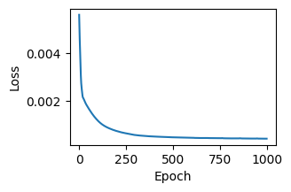
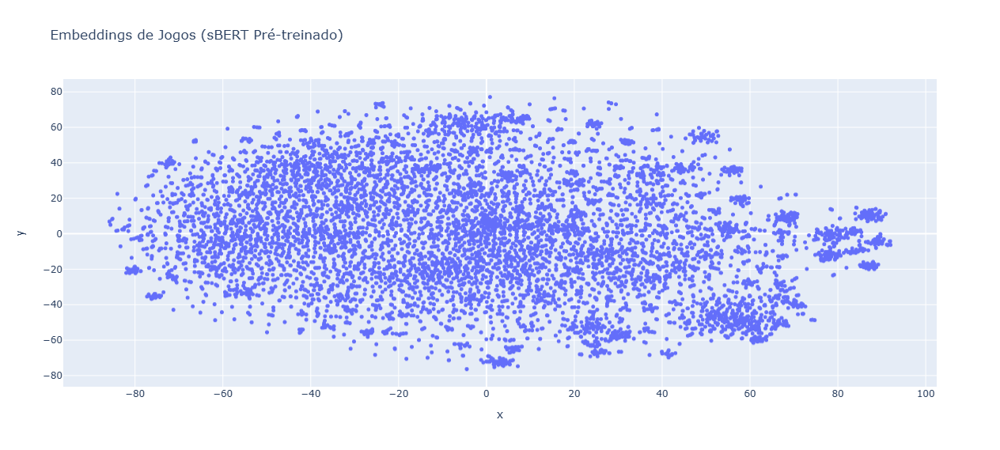
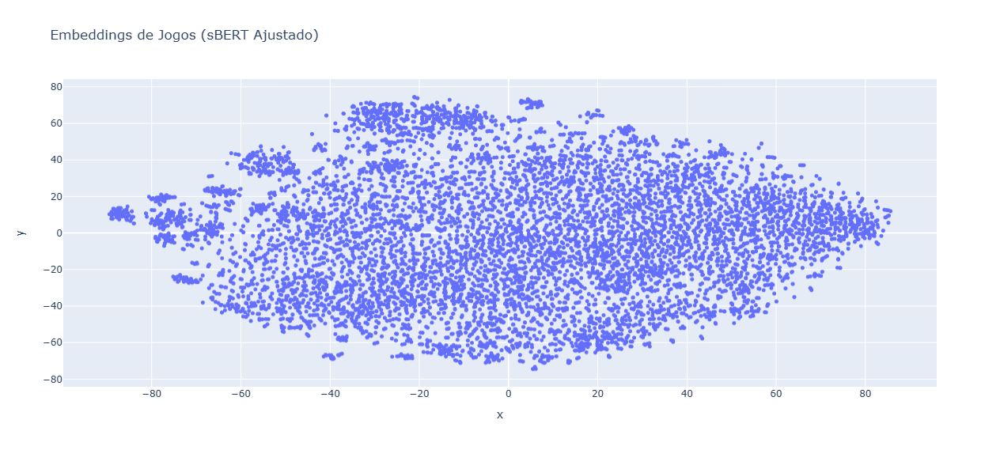

# GamesSummary - Projeto de Recomendação de Jogos - Versão com Embeddings
Feito por: Marlon Silva Pereira

## Introdução
Este projeto consiste em uma sistema de recomendação de jogos que utiliza a técnica de embeddings para análise de similaridade entre descrições de jogos. O objetivo é oferecer recomendações personalizadas aos usuários com base nas características e temáticas dos jogos, utilizando um conjunto de dados extraído do Metacritic. Além das recomendações, o sistema fornece links diretos para as páginas dos jogos na plataforma, onde os usuários podem acessar críticas e avaliações detalhadas.

1. Descrição do Dataset:

Para este projeto, utilizei um conjunto de dados de descrições de jogos, que foi o mesmo utilizado na APS 1. Esse dataset foi gerado através de scraping da página [Metacritic](https://www.metacritic.com/), contendo informações textuais que descrevem o jogo em termos de sua temática, mecânicas e experiência geral oferecida ao jogador. Esse conjunto de dados é ideal para desenvolver uma busca por similaridade, uma vez que as descrições oferecem contexto suficiente para diferenciar os jogos uns dos outros.

2. Processo de Geração de Embeddings:

Iniciei o processo de geração de embeddings utilizando um modelo pré-treinado SBERT (all-MiniLM-L6-v2), que gera embeddings de frases, mantendo a semântica das descrições textuais. Para aprimorar esses embeddings pré-treinados, utilizei um autoencoder de duas camadas, com uma camada de codificação e uma de decodificação. A camada de entrada do autoencoder possui 384 dimensões (a dimensão dos embeddings SBERT), e a camada oculta foi configurada com 128 unidades. Esse ajuste permite que o autoencoder aprenda uma representação mais compacta e relevante dos dados para o conjunto de descrições específico.

3. Treinamento e Função de Perda:

Durante o treinamento do autoencoder, usei a função de perda de erro quadrático médio (MSE Loss), que mede a diferença entre as entradas e as saídas do autoencoder. Essa função de perda é adequada para o problema porque queremos minimizar a diferença entre os embeddings originais e reconstruídos, o que ajuda o modelo a capturar as principais características das descrições dos jogos sem perder muita informação. O treinamento foi realizado por 1000 épocas com uma taxa de aprendizado de 0,001, usando o otimizador Adam para ajuste dos pesos.

A função de perda utilizada foi:

%5E2)

onde:
- x_i é o embedding original,
- hat(x_i) é o embedding reconstruído,
- n é o número total de amostras.

Gráfico de perda:

4. Figuras mostrando os embeddings pré-treinados e ajustados:

As figuras acima mostram os embeddings para as descrições dos jogos projetados em um espaço 2D utilizando TSNE. A primeira imagem exibe os embeddings pré-treinados (sBERT sem ajuste), enquanto a segunda mostra os embeddings após o ajuste com o autoencoder.

5. Discussão sobre os clusters observados em cada figura:

Na comparação das figuras, observa-se pouca diferença entre os embeddings pré-treinados e os ajustados. Ambos mostram uma distribuição difusa, com agrupamentos não muito claros. No entanto, após o ajuste, é possível notar uma leve tendência de maior clusterização, indicando que o autoencoder ajudou a organizar melhor algumas descrições, ainda que de forma sutil.

Essa mudança sugere que o ajuste fino dos embeddings contribuiu para capturar características um pouco mais específicas do conjunto de dados de jogos, mas sem uma separação muito evidente entre os grupos. A visualização colorida com as categorias pode ajudar a identificar melhor a relação entre esses agrupamentos e as diferentes temáticas dos jogos.

6. Testes de busca

## Casos de Testes:

1. Resposta com 10 resultados: "RPG" 
Essa pesquisa retorna continua retornando 10 resultados por causa do estilo "RPG" ser um tema comum no mundo dos jogos

| Index | Game Name                          | Description                                           | URL                                                   | Relevance |
|-------|------------------------------------|------------------------------------------------------|-------------------------------------------------------|-----------|
| 0     | Deus Ex                            | The game that incorporates RPG, action, advent...    | [Link](https://www.metacritic.com/game/deus-ex/)      | 0.986660  |
| 1     | Etrian Odyssey Origins Collection  | Explore the rich beginnings of this RPG franch...     | [Link](https://www.metacritic.com/game/etrian-odyssey...) | 0.982939  |
| 2     | Letter Quest: Grimm's Journey     | Cross Scrabble with an RPG and see what you get.     | [Link](https://www.metacritic.com/game/letter-quest-grimms-journey) | 0.982382  |
| 3     | Crimson Gem Saga                   | The game, a lovingly crafted exploration into ...      | [Link](https://www.metacritic.com/game/crimson-gem-saga) | 0.981232  |
| 4     | Avernum 2: Crystal Souls          | An indie fantasy role-playing adventure in a m...      | [Link](https://www.metacritic.com/game/avernum-2-crystal-souls) | 0.980565  |
| 5     | Phantasy Star Collection           | Relive the series that revolutionized RPG gami...       | [Link](https://www.metacritic.com/game/phantasy-star-collection) | 0.980317  |
| 6     | Broforce                           | A ridiculously violent platform game about bei...      | [Link](https://www.metacritic.com/game/broforce/)     | 0.980285  |
| 7     | Elderand                           | Explore a dangerous world and fight deadly cre...      | [Link](https://www.metacritic.com/game/elderand/)     | 0.980116  |
| 8     | Darwinia+                         | Combining fast paced action with strategic bat...       | [Link](https://www.metacritic.com/game/darwinia/)     | 0.980041  |
| 9     | Heroes of Might and Magic V       | The first game to reintroduce the video game l...      | [Link](https://www.metacritic.com/game/heroes-of-might-and-magic-v) | 0.979917  |

2. Resposta com menos de 10 resultados: "Educational" 
Essa pesquisa passou a retornar 10 resultados para essa nova versão. Isso se deve ao fato da ligação do tema  "educational" a contextos como academia, estudante, pesquisa ou ciências, presentes nas descrições dos jogos recomendados.

| Index | Game Name                                             | Description                                          | URL                                                   | Relevance |
|-------|------------------------------------------------------|-----------------------------------------------------|-------------------------------------------------------|-----------|
| 0     | As Far As The Eye                                    | You play as the Pupils, a civilization that mu...   | [Link](https://www.metacritic.com/game/as-far-as-the-eye) | 0.954830  |
| 1     | The Legend of Heroes: Trails of Cold Steel          | At the elite Thors Military Academy, Erebonias...    | [Link](https://www.metacritic.com/game/the-legend-of-heroes-trails-of-cold-steel) | 0.947062  |
| 2     | Kero Blaster                                         | A classically-styled 2D side scrolling action ...    | [Link](https://www.metacritic.com/game/keroblaster/) | 0.945708  |
| 3     | Magical Starsign                                     | The students of Will O'Wisp magical academy ha...     | [Link](https://www.metacritic.com/game/magical-starsign) | 0.944117  |
| 4     | Werewolves Within                                     | A game of social deduction that brings the fun...     | [Link](https://www.metacritic.com/game/werewolves-within) | 0.943956  |
| 5     | The Signifier                                        | This psychological thriller journeys from the ...      | [Link](https://www.metacritic.com/game/the-signifier/) | 0.943658  |
| 6     | Dark Cloud 2                                         | [Known as "Dark Chronicle" in the UK] Live the...    | [Link](https://www.metacritic.com/game/dark-cloud-2/) | 0.943583  |
| 7     | Monster Rancher 3                                    | The latest installment in the series lets play...     | [Link](https://www.metacritic.com/game/monster-rancher-3) | 0.943010  |
| 8     | Dawn of Man                                          | Command a settlement of ancient humans, guide ...     | [Link](https://www.metacritic.com/game/dawn-of-man/) | 0.942890  |
| 9     | Inazuma Eleven Go: Shadow                            | Inazuma Eleven Go puts you at the center of a ...     | [Link](https://www.metacritic.com/game/inazuma-eleven-go-shadow) | 0.942847  |

3. Resposta não óbvia: "Brazil"

Esta pesquisa retorna jogos relacionados ao termo "Brazil", sendo quase todos jogos de futebol que fazem referência direta ou não ao país, provavelmente devido à comum inserção do país no contexto de futebol. Porém dois casos apresentaram diferenças, sendo um jogo referente à Fórmula 1, e outro referente à conquista de nações .

| Index | Game Name                         | Description                                          | URL                                                   | Relevance |
|-------|-----------------------------------|-----------------------------------------------------|-------------------------------------------------------|-----------|
| 0     | World Tour Soccer 2003           | [Also known as "This is Football 2002"] Featu...    | [Link](https://www.metacritic.com/game/world-tour-soccer-2003) | 0.932404  |
| 1     | World Tour Soccer                 | Who knows where your next challenge will come ...    | [Link](https://www.metacritic.com/game/world-tour-soccer) | 0.931101  |
| 2     | RedCard 20-03                    | Finally, a videogame that understands soccer r...     | [Link](https://www.metacritic.com/game/redcard-20-03/) | 0.930784  |
| 3     | World Tour Soccer 2002           | Known as "This is Football 2002" for its Europ...    | [Link](https://www.metacritic.com/game/world-tour-soccer-2002) | 0.927026  |
| 4     | FIFA World Cup: Germany 2006     | 2006 FIFA World Cup features 12 official stadi...    | [Link](https://www.metacritic.com/game/fifa-world-cup-germany-2006) | 0.926808  |
| 5     | 2010 FIFA World Cup South Africa  | EA SPORTS 2010 FIFA World Cup South Africa fea...    | [Link](https://www.metacritic.com/game/2010-fifa-world-cup-south-africa) | 0.925400  |
| 6     | FIFA Soccer 2004                 | A new Career Mode gives you the chance to take...    | [Link](https://www.metacritic.com/game/fifa-soccer-2004) | 0.924161  |
| 7     | F1 2017                          | Win the 2017 World Championship, break every r...    | [Link](https://www.metacritic.com/game/f1-2017)     | 0.922386  |
| 8     | Pro Evolution Soccer 2           | North America, the wait is over. Experience th...    | [Link](https://www.metacritic.com/game/pro-evolution-soccer-2) | 0.921550  |
| 9     | Supreme Ruler 2010               | The year is 2010 and the Major Powers of the w...    | [Link](https://www.metacritic.com/game/supreme-ruler-2010) | 0.921006  |
